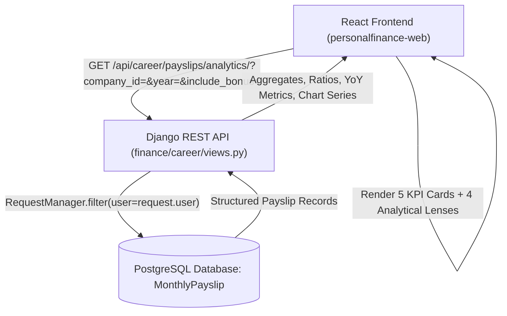

# Career Hub: Payroll, Tax & Pension Intelligence Architecture

## 1. Executive Summary

This architecture specification details a dedicated, deep-dive analytical subsystem designed to extract and visualize financial intelligence from structured career payslips (`MonthlyPayslip`).

The system eliminates operational noise (excluding time/attendance metrics) and focuses entirely on **gross-to-net cashflows, statutory deduction friction, pension asset accumulation, tax seasonality, and lifetime career compensation trajectories**.

The architecture combines a high-performance Django REST aggregation endpoint with an interactive, responsive React/Recharts dashboard accessible directly via the sidebar navigation and the Career Hub.

---

## 2. System Architecture & Data Flow



---

## 3. Backend Specification

### 3.1 Endpoint Definition
* **URL:** `/api/career/payslips/analytics/`
* **Method:** `GET`
* **Authentication:** Authenticated user session / token (isolated via `RequestManager`).
* **Query Parameters:**
  * `company_id` (optional `int`): Filters analytics to a specific employer tenure.
  * `year` (optional `int`): Filters analytics to a specific calendar year.
  * `include_bonus` (optional `bool`, default: `true`): When `false`, filters out bonus statements (`is_bonus=False`) to analyze baseline salary trajectory without seasonal spikes.

### 3.2 Response Payload Schema
The endpoint returns a structured JSON payload:

```json
{
  "status": true,
  "message": "Success",
  "data": {
    "summary": {
      "total_gross_pay": 45200000.0,
      "total_net_pay": 35350000.0,
      "total_social_insurance": 5620000.0,
      "total_pension_employee": 3150000.0,
      "total_pension_system_contribution": 6300000.0,
      "total_health_insurance": 2210000.0,
      "total_employment_insurance": 260000.0,
      "total_income_tax": 2180000.0,
      "total_resident_tax": 2050000.0,
      "total_taxes": 4230000.0,
      "total_year_end_adjustment": -120000.0,
      "total_other_deductions": 0.0,
      "total_deductions": 9850000.0,
      "overall_take_home_ratio": 78.21,
      "overall_tax_ratio": 9.36,
      "overall_social_ratio": 12.43,
      "overall_deduction_ratio": 21.79,
      "payslips_count": 64
    },
    "yearly_comparisons": [
      {
        "year": 2025,
        "gross_pay": 9800000.0,
        "net_pay": 7650000.0,
        "pension": 680000.0,
        "health_insurance": 470000.0,
        "social_insurance_total": 1210000.0,
        "income_tax": 480000.0,
        "resident_tax": 460000.0,
        "total_tax": 940000.0,
        "total_deductions": 2150000.0,
        "take_home_ratio": 78.06,
        "yoy_gross_growth_pct": 8.89,
        "yoy_net_growth_pct": 7.44
      }
    ],
    "monthly_timeline": [
      {
        "year_month": "2025-05",
        "year": 2025,
        "month": 5,
        "is_bonus": false,
        "company_id": 2,
        "company_name": "Astellas Pharma",
        "gross_pay": 847664.0,
        "net_pay": 678812.0,
        "pension": 58560.0,
        "health_insurance": 39420.0,
        "employment_insurance": 5085.0,
        "social_insurance_total": 103065.0,
        "income_tax": 38787.0,
        "resident_tax": 27000.0,
        "total_tax": 65787.0,
        "total_deductions": 168852.0,
        "take_home_ratio": 80.08,
        "std_remuneration_pension": 620000.0,
        "std_remuneration_health": 620000.0
      }
    ],
    "deduction_composition": [
      { "name": "Welfare Pension", "amount": 3150000.0, "percentage": 31.98, "color": "#0284c7" },
      { "name": "Health Insurance", "amount": 2210000.0, "percentage": 22.44, "color": "#06b6d4" },
      { "name": "Income Tax", "amount": 2180000.0, "percentage": 22.13, "color": "#f59e0b" },
      { "name": "Resident Tax", "amount": 2050000.0, "percentage": 20.81, "color": "#ec4899" },
      { "name": "Employment Insurance", "amount": 260000.0, "percentage": 2.64, "color": "#10b981" }
    ]
  }
}
```

---

## 4. Frontend Architecture & User Interface

### 4.1 Navigation & Placement
1. **Sidebar Integration (`Sidebar.tsx`):**
   * Placed under the **Career Hub** accordion menu as a dedicated 5th item:
     * Label: **"Payroll & Tax Analytics"**
     * Icon: `LineChart` (in vibrant cyan `#06b6d4`).
2. **Career Hub Integration (`CareerHubView.tsx`):**
   * Top-right contextual header action button:
     * **`📊 Payroll Analytics`**
     * Clicking toggles the view to `PayrollAnalyticsView`.
3. **Return Breadcrumb:**
   * Header includes a quick return link: `← Back to Career Timeline & Vault`.

### 4.2 Top Control Deck
* **Company Selector:** Dropdown with `All Companies (Career-Wide)` and registered employers.
* **Fiscal Year Selector:** Dropdown with `All Time (Lifetime)` and available payroll years (`2025`, `2024`, `2023`, etc.).
* **Bonus Toggle:** Interactive toggle pill: `[Include Seasonal Bonuses]` (default: ON).

### 4.3 High-Impact KPI Ribbon (5 Metric Cards)
1. **Cumulative Gross Earnings:** Total top-line earned with average monthly gross badge.
2. **Net Take-Home Pay:** Total cash deposited in bank accounts (`#10b981`).
3. **Net Retention Ratio:** Retention percentage (e.g. `78.2%`) with total deduction friction tag (`-21.8%`).
4. **Pension Accumulated & System Equity:** Employee welfare pension paid with **statutory 50/50 employer match doubling** badge (`Total System Equity: ¥2X,XXX,XXX`).
5. **Total Tax Friction:** Cumulative national income tax + municipal resident tax with effective combined tax rate.

---

## 5. The 4 Analytical Lenses

### 5.1 Lens 1: Cashflow Friction & Deductions Breakdown
* **Objective:** Answer "Where does my gross salary go every month?"
* **Visualizations:**
  * **Gross-to-Net Waterfall / Stacked Bar:** Monthly bars stacked by `Net Pay`, `Welfare Pension`, `Health Insurance`, `Income Tax`, `Resident Tax`, and `Other Deductions`.
  * **Deduction Split Donut Chart:** Visual breakdown of the deduction pie.
  * **Ratio Indicators:** Social Insurance Burden % vs. Tax Burden %.

### 5.2 Lens 2: Pension & Social Security Vault (`年金・社会保険`)
* **Objective:** Track long-term retirement safety net and employer matching value.
* **Visualizations:**
  * **Cumulative Pension & Employer Mirror Curve:** Dual-line area chart showing cumulative employee pension payments alongside the statutory matching employer payments to the Japan Pension Service (`日本年金機構`).
  * **Standard Monthly Remuneration Step-Chart (`標準報酬月額`):** Step-line progression illustrating standard remuneration grade adjustments across career promotions and annual September revisions (`定時決定`).
  * **Health & Employment Protection Summary:** Cumulative health insurance and employment insurance safety net investment.

### 5.3 Lens 3: Tax Burden Dynamics (`所得税 vs 住民税`)
* **Objective:** Decode the friction between national income taxes and municipal inhabitant taxes.
* **Visualizations:**
  * **Monthly Grouped Bar Chart:** Direct comparison of `Income Tax` vs. `Resident Tax` per month.
  * **June Inhabitant Tax Reset Callout:** Highlights the annual June jump in municipal tax based on the preceding calendar year's taxable income.
  * **December Year-End Adjustment (`年末調整`):** Highlights December tax refunds (credits) or additional tax withholdings.

### 5.4 Lens 4: Multi-Year Trajectory & YoY Comparative Audit Ledger
* **Objective:** Evaluate long-term career growth, compensation expansion, and year-over-year trends.
* **Visualizations:**
  * **Lifetime Cumulative Gross vs. Net Area Curve:** Visualizes career wealth accumulation and expanding deduction gap over time.
  * **Dense YoY Comparative Audit Table:**
    * Columns: `Year`, `Gross Pay`, `Social Insurance`, `National Tax`, `Resident Tax`, `Total Deductions`, `Net Take-Home`, `Take-Home %`, `YoY Growth %`.
    * Color-coded positive/negative growth badges.

---

## 6. Component File Structure

```
personalfinance-web/src/components/career/
├── PayrollAnalyticsView.tsx            # Main container view, state & filters
└── analytics/
    ├── PayrollKPIHeader.tsx           # 5 Hero KPI cards with micro-trends
    ├── PayrollFrictionLens.tsx        # Lens 1: Gross-to-net waterfall & donut
    ├── PensionVaultLens.tsx           # Lens 2: Cumulative pension & bracket tracker
    ├── TaxDynamicsLens.tsx            # Lens 3: Income vs Resident tax & June/Dec events
    └── CumulativeYoYLens.tsx          # Lens 4: Cumulative curves & YoY audit table
```

---

## 7. Security, Tenant Isolation & Error Handling

1. **Tenant Isolation:** All database aggregations enforce `RequestManager` (`user=request.user`) ensuring users cannot query or calculate another user's payslips.
2. **Zero-Data State:** Renders an informative empty state prompting users to upload their first payslip PDF.
3. **Filtered-Out State:** If a filter yields zero results, displays an inline notification with a one-click "Reset Filters" action.
4. **Statutory Employer Matching Transparency:** Clearly distinguishes between personal withholding amounts and estimated employer matching to ensure financial accuracy.

---

## 8. Verification & Testing Strategy

* **Backend Unit & Integration Tests (`finance/career/tests/test_payslip_analytics_view.py`):**
  * Assert exact mathematical precision for gross, net, pension, health, and tax aggregations.
  * Test `company_id`, `year`, and `include_bonus` query parameter filters.
  * Test tenant separation.
* **Frontend Verification:**
  * Run `npm run build` in `personalfinance-web` ensuring clean TypeScript compilation.
  * Validate responsive layout across window resizing.
