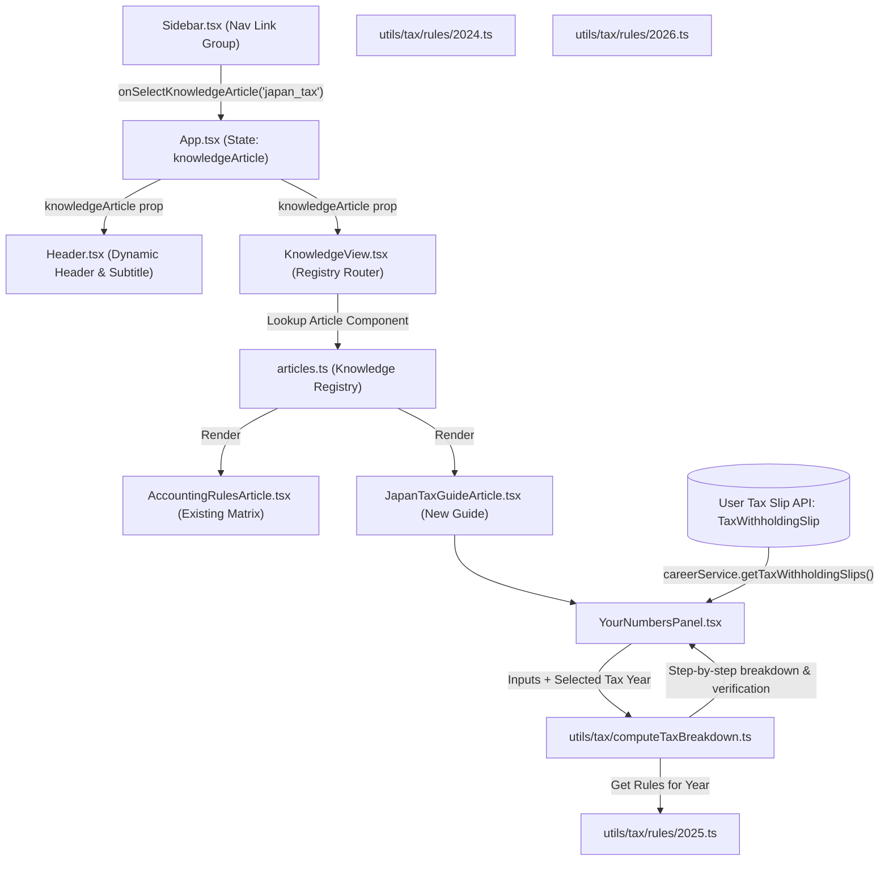

# Knowledge Hub Redesign & Comprehensive Japan Tax Guide Architecture Specification

## 1. Executive Summary

This specification defines the architectural design for transforming the **Knowledge Section** in Personal Finance Web (`personalfinance-web`) from a single static page into a modular, multi-article Knowledge Hub.

The redesign introduces:
1. An **expandable navigation structure** in the Sidebar for Knowledge Articles, matching the established sub-navigation pattern of the Career Hub.
2. A **Comprehensive Japan Tax & Withholding Intelligence Guide** explaining Japanese Income Tax (所得税), Resident Tax (住民税), Social Insurance (社会保険), Withholding vs. Year-End Adjustment (年末調整), Bonus Taxes, Tax Deduction mechanisms, Tax Reduction strategies, and Stock Loss carry-forwards (確定申告).
3. A **Year-Aware Pure Calculation Engine** (`utils/tax/computeTaxBreakdown.ts`) executing exact statutory formulas for 2024, 2025 (post-2025 tax reform thresholds), and 2026+.
4. An **Interactive "Your Numbers" Panel** that dynamically binds to the user's extracted 源泉徴収票 (Tax Withholding Slips) from the database, displaying a side-by-side verification and step-by-step mathematical breakdown.

---

## 2. System Architecture & Navigational Data Flow



---

## 3. Sidebar Navigation & Layout Redesign

### 3.1 Sidebar Expandable Sub-Navigation
In `Sidebar.tsx`, Knowledge changes from a single nav button to an expandable group:
- **Parent item**: Knowledge (`BookOpen` icon) with a collapsible chevron toggle.
- **Sub-items**:
  - 🧾 **Accounting Rules** (`id: "accounting"`) — Existing classification matrix.
  - 🏛 **Japan Tax Guide** (`id: "japan_tax"`) — Comprehensive tax guide & calculation panel.
- **Collapsed Sidebar Behavior**: When the sidebar is collapsed, clicking the Knowledge icon navigates to the currently active sub-article.

### 3.2 Main Layout & Header Synchronization
In `Header.tsx`, the header context for `knowledge` dynamically resolves title and subtitle based on `knowledgeArticle`:
- `accounting`: Title: *"Accounting Knowledge & Classification Handbook"*, Subtitle: *"Rules and accounting treatments for card payments, bank debits, ATM cash, and investments"*.
- `japan_tax`: Title: *"Japan Income Tax & Resident Tax Intelligence"*, Subtitle: *"Demystifying statutory withholdings, progressive brackets, deductions, and 源泉徴収票 formulas"*.

---

## 4. Knowledge Article Registry Architecture

Files created under `src/components/knowledge/`:

```
src/components/knowledge/
├── KnowledgeView.tsx               # Entry router executing registry lookup
├── articles.ts                     # Knowledge registry array & metadata definition
├── accounting/
│   └── AccountingRulesArticle.tsx  # Extracted original matrix code (unaltered logic)
└── tax/
    ├── JapanTaxGuideArticle.tsx    # Page container with sticky Table of Contents
    ├── YourNumbersPanel.tsx        # Dynamic tax slip calculation panel
    ├── components/
    │   ├── FormulaCard.tsx         # Styled math formula display component
    │   ├── BracketTable.tsx        # Income tax progressive brackets visualization
    │   ├── DeductionCard.tsx       # Interactive deduction explanation card
    │   └── StepFlow.tsx            # Visual progress flow connector
    └── sections/
        ├── OverviewSection.tsx               # Gross pay to Net income flow
        ├── SocialInsuranceSection.tsx        # Health, Pension, Employment Insurance
        ├── IncomeTaxSection.tsx              # Progressive tax rates & surtax
        ├── ResidentTaxSection.tsx            # 10% rate, per-capita, 1-year lag
        ├── WithholdingVsYearEndSection.tsx   # Monthly estimate vs 年末調整
        ├── BonusTaxSection.tsx               # Prior month social insurance rate rules
        ├── DeductionsDeepDiveSection.tsx     # All statutory tax credits/deductions
        ├── TaxReductionStrategiesSection.tsx # iDeCo, NISA, Furusato Nozei, 医療費控除
        └── StockLossesSection.tsx            # 確定申告, 3-year loss carry-forward
```

---

## 5. Pure Calculation Engine & Year-Specific Rules Schema

### 5.1 Directory & File Layout
```
src/utils/tax/
├── types.ts                      # Interfaces for inputs, rules, and outputs
├── rules/
│   ├── index.ts                  # Year lookup dispatcher (getTaxRulesForYear)
│   ├── 2024.ts                   # 2024 statutory tax parameters
│   ├── 2025.ts                   # 2025 tax reform parameters (raised basic/salary deductions)
│   └── 2026.ts                   # 2026+ updated tax parameters
└── computeTaxBreakdown.ts        # Pure calculation engine
```

### 5.2 Rule Schema Definition (`types.ts`)
```typescript
export interface SalaryDeductionTier {
  minGross: number;
  maxGross: number;
  formula: (gross: number) => number;
}

export interface IncomeTaxBracket {
  minTaxable: number;
  maxTaxable: number;
  rate: number;
  quickDeduction: number;
}

export interface BasicDeductionTier {
  minTotalIncome: number;
  maxTotalIncome: number;
  deductionAmount: number;
}

export interface TaxRules {
  taxYear: number;
  salaryDeductionTiers: SalaryDeductionTier[];
  basicDeductionTiers: BasicDeductionTier[];
  incomeTaxBrackets: IncomeTaxBracket[];
  reconstructionSurtaxRate: number; // 0.021 (2.1%)
  residentTaxIncomeRate: number;    // 0.10 (10%: 6% city + 4% pref)
  residentTaxPerCapita: number;     // 5000 (¥5,000)
}
```

### 5.3 Statutory Rule Definitions

#### 2024 Rules (`2024.ts`)
- **Salary Income Deduction**: Minimum ¥550,000 for gross under ¥1,625,000 up to maximum ¥1,950,000 cap for gross over ¥8,500,000.
- **Basic Deduction**: Flat ¥480,000 for total income $\le$ ¥24,000,000.
- **Reconstruction Surtax**: 2.1% of base income tax payable.
- **Resident Tax**: 10% (6% Municipal + 4% Prefectural) + ¥5,000 per-capita levy.

#### 2025 Reform Rules (`2025.ts`)
- **Salary Income Deduction Minimum**: Raised to ¥650,000 for gross under ¥1,900,000.
- **Basic Deduction Tiers**: Raised up to ¥950,000 for total income $\le$ ¥1,320,000, sliding to ¥580,000–¥880,000 across intermediate income tiers.
- **Resident Tax**: Maintained at 10% income rate + ¥5,000 per-capita levy with maximum ¥430,000 basic deduction.

### 5.4 Calculation Pipeline & Pure Function (`computeTaxBreakdown.ts`)

```typescript
export interface TaxSlipInputs {
  grossSalary: number;                 // 支払金額
  socialInsuranceDeduction: number;   // 社会保険料等の金額
  lifeInsuranceDeduction?: number;    // 生命保険料の控除額
  earthquakeInsuranceDeduction?: number; // 地震保険料の控除額
  spouseDeduction?: number;           // 配偶者控除額
  dependentsCount?: number;           // 扶養親族の数
  housingLoanDeduction?: number;      // 住宅借入金等特別控除額
  actualWithholdingTaxOnSlip?: number; // 源泉徴収税額 (for verification)
}

export interface CalculationStep {
  stepId: string;
  title: string;
  formulaDescription: string;
  mathExpression: string;
  resultValue: number;
}

export interface TaxBreakdownResult {
  year: number;
  grossSalary: number;
  salaryIncomeDeduction: number;
  netSalaryIncome: number;
  basicDeduction: number;
  totalIncomeDeductions: number;
  taxableIncome: number;
  baseIncomeTax: number;
  reconstructionSurtax: number;
  calculatedWithholdingTax: number;
  actualWithholdingTax?: number;
  discrepancy: number;
  estimatedResidentTax: number;
  steps: CalculationStep[];
}
```

---

## 6. Interactive "Your Numbers" Calculation Panel

Located prominently at the top of the Japan Tax Guide, the `YourNumbersPanel` component provides:
1. **Tax Slip Dropdown Selector**: Automatically lists all `TaxWithholdingSlip` records in the database (e.g. 2025 Mizuho, 2024 Rakuten) fetched via `careerService.getTaxWithholdingSlips()`.
2. **Dynamic Rule Switcher**: Uses the tax year from the selected slip to load the corresponding statutory rules.
3. **Verification Summary Card**:
   - Displays **Extracted 源泉徴収税額** vs **Calculated Tax**.
   - Highlights matching status (e.g. *"Exact Statutory Match"* or *"Year-End Adjustment Difference: ¥X"*).
4. **Step-by-Step Interactive Accordion**:
   - **Step 1: Gross Salary to Salary Income** (給与所得控除後の金額).
   - **Step 2: Total Income Deductions** (所得控除の額の合計額).
   - **Step 3: Taxable Income** (課税所得金額 rounded down to nearest ¥1,000).
   - **Step 4: Income Tax & Reconstruction Surtax** (所得税 及び 復興特別所得税).
   - **Step 5: Resident Tax Projection** (翌年度 住民税 概算).
5. **Educational Disclaimer**: Clean banner clarifying that numbers are calculated estimates for executive financial planning.

---

## 7. Verification & Quality Assurance Plan

1. **Unit Testing (`computeTaxBreakdown.test.ts`)**:
   - Test 2024 gross salary ¥5,000,000 with standard social insurance $\rightarrow$ verify exact salary deduction, taxable income, and tax payable.
   - Test 2025 reform thresholds $\rightarrow$ verify ¥650,000 minimum salary deduction and tiered basic deduction calculations.
   - Test housing loan credit subtractions and zero-tax boundary conditions.
2. **Linting & Type-Checking**:
   - Execute `npm run lint -- --quiet` to ensure 0 errors.
   - Execute `npm run build:django` to verify Vite bundle compilation and TypeScript checks.
3. **UI Verification**:
   - Verify smooth switching between Accounting Rules and Japan Tax Guide tabs in sidebar.
   - Verify responsive sticky table of contents navigation.
